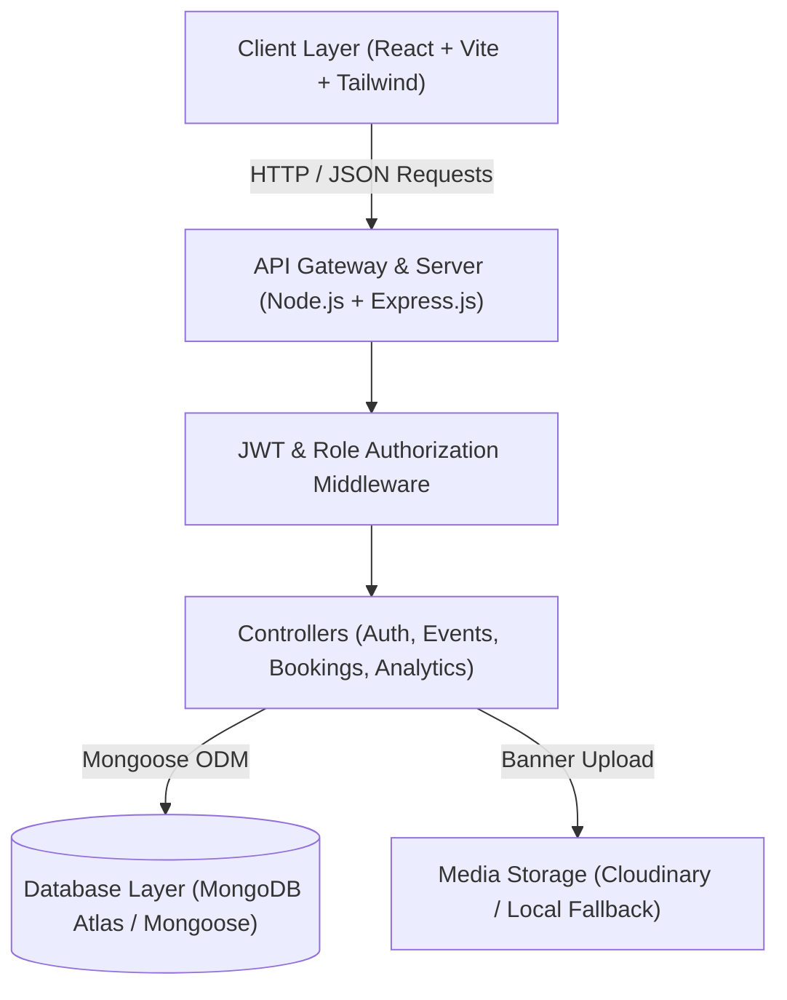
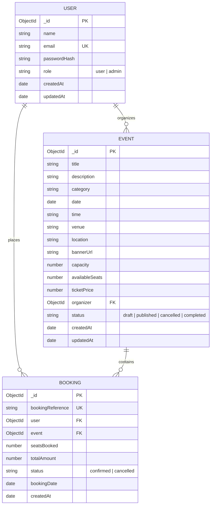
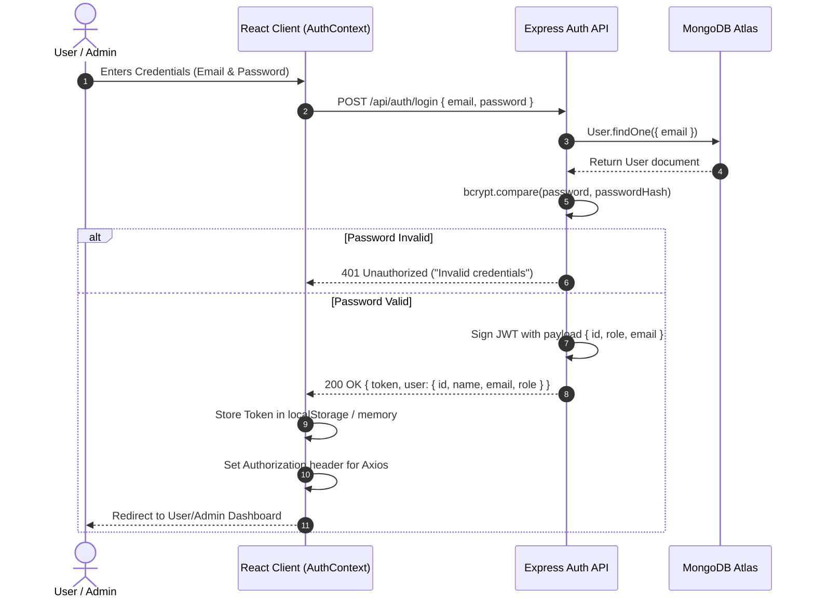
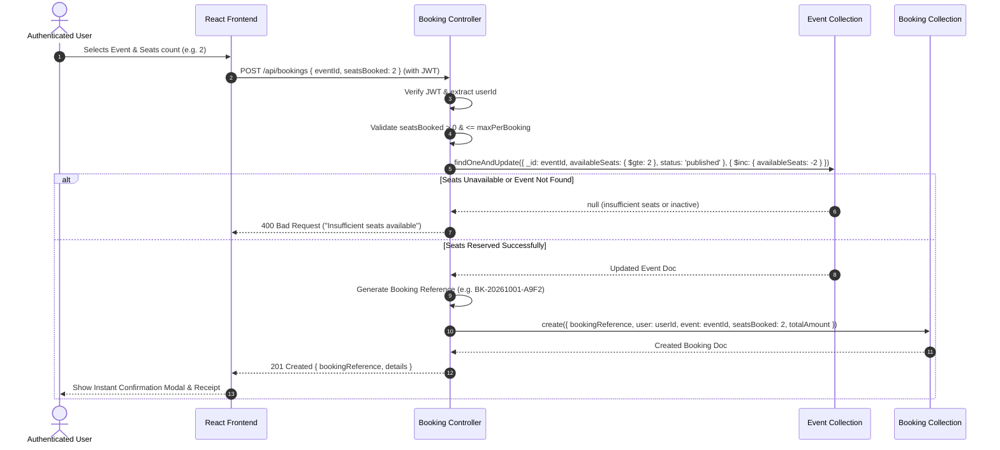

# System Architecture: Event Booking System
**Web Development Capstone Project :  SkillOrbit**

---

## 1. High-Level System Architecture

The Event Booking System follows a clean, decoupled **Client-Server Architecture** communicating over a RESTful JSON API.



---

## 2. Frontend Architecture (React.js + Vite)

The frontend is structured modularly for maintainability, high performance, and clear separation of concerns.

```
frontend/
├── public/                  # Static assets & favicons
├── src/
│   ├── assets/              # Logos, placeholders, demo imagery
│   ├── components/
│   │   ├── common/          # Navbar, Footer, Button, Input, Modal, Badge, Toast
│   │   ├── events/          # EventCard, EventGrid, EventFilter, EventSearch
│   │   ├── bookings/        # BookingModal, TicketCounter, ConfirmationCard
│   │   └── dashboard/       # StatCard, TrendChart, CategoryChart, RecentBookingsTable
│   ├── context/
│   │   └── AuthContext.jsx  # Global session, user credentials, login/logout actions
│   ├── hooks/
│   │   ├── useAuth.js       # Hook to access auth context
│   │   └── useFetch.js      # Utility hook for asynchronous operations
│   ├── layouts/
│   │   ├── MainLayout.jsx   # Public/User wrapper with Navbar & Footer
│   │   └── AdminLayout.jsx  # Admin wrapper with Sidebar & Topbar
│   ├── pages/
│   │   ├── public/          # Home, EventListing, EventDetails, Login, Register, NotFound
│   │   ├── user/            # UserDashboard, MyBookings, BookingConfirmation
│   │   └── admin/           # AdminDashboard, ManageEvents, CreateEvent, EditEvent, ManageBookings, Reports
│   ├── routes/
│   │   ├── AppRoutes.jsx    # BrowserRouter with route definitions
│   │   ├── ProtectedRoute.jsx # Guard for logged-in users
│   │   └── AdminRoute.jsx   # Guard restricted to role: 'admin'
│   ├── services/
│   │   ├── api.js           # Central Axios instance with JWT interceptor
│   │   ├── authService.js   # Login, Register, getCurrentUser
│   │   ├── eventService.js  # Event CRUD operations
│   │   ├── bookingService.js# Booking submission, user bookings, cancel
│   │   └── reportService.js # Admin metrics & CSV export download
│   ├── utils/
│   │   ├── formatters.js    # Date, currency, string helpers
│   │   └── validators.js    # Client-side input validation rules
│   ├── App.jsx
│   ├── index.css            # Tailwind directives & base styles
│   └── main.jsx
├── tailwind.config.js
├── vite.config.js
└── package.json
```

---

## 3. Backend Architecture (Node.js + Express.js)

The backend follows the **Controller-Service-Repository/Model** pattern to keep business logic isolated and testable.

```
backend/
├── src/
│   ├── config/
│   │   ├── db.js            # MongoDB Atlas connection handler
│   │   └── cloudinary.js    # Cloudinary SDK configuration & fallbacks
│   ├── controllers/
│   │   ├── authController.js    # Registration, login, current profile
│   │   ├── eventController.js   # List, get, create, update, delete events
│   │   ├── bookingController.js # Create booking, get user bookings, cancel
│   │   ├── adminController.js   # Dashboard metrics, all bookings, user lists
│   │   └── reportController.js  # CSV export generators
│   ├── middleware/
│   │   ├── authMiddleware.js    # Verify Bearer JWT
│   │   ├── roleMiddleware.js    # Verify Admin privileges
│   │   ├── errorMiddleware.js   # Centralized error and 404 handler
│   │   └── uploadMiddleware.js  # Multer handling for images
│   ├── models/
│   │   ├── User.js              # User schema (roles, bcrypt pre-save)
│   │   ├── Event.js             # Event schema (capacity, seats, schedule)
│   │   └── Booking.js           # Booking schema (ref, tickets, status)
│   ├── routes/
│   │   ├── authRoutes.js
│   │   ├── eventRoutes.js
│   │   ├── bookingRoutes.js
│   │   ├── adminRoutes.js
│   │   └── reportRoutes.js
│   ├── utils/
│   │   ├── generateReference.js # Unique booking reference generator
│   │   └── seedData.js          # Seed initial sample events & admin account
│   ├── app.js                   # Express app setup, CORS, JSON parsers, routes
│   └── server.js                # Server listener entry point
├── .env.example
├── package.json
└── vercel.json / render.yaml
```

---

## 4. Database Architecture (MongoDB Schemas)



### Key Integrity Rules:
1. **Seat Integrity**: `availableSeats` is checked and decremented atomically via `{ $inc: { availableSeats: -seatsBooked } }` with condition `{ availableSeats: { $gte: seatsBooked } }`.
2. **Reference Uniqueness**: `bookingReference` has a unique index to ensure zero collision.
3. **Role Segregation**: Users cannot self-assign `admin` role upon registration.

---

## 5. Authentication Flow



---

## 6. Safe Booking Workflow



---

## 7. Deployment Architecture

- **Client Application**: Hosted on **Vercel** with automatic SPA rewrites (`vercel.json`) pointing to `index.html`.
- **Server Application**: Hosted on **Render** (Web Service, Node environment) with automated health check `/api/health`.
- **Database**: Cloud-hosted **MongoDB Atlas** with IP access configured for production.
- **Media**: **Cloudinary** media storage with secure HTTPS delivery and local filesystem fallback during offline/dev mode.
- **Continuous Integration / Source Control**: Clean repository structure on **GitHub** with separated `.env.example` configurations.
