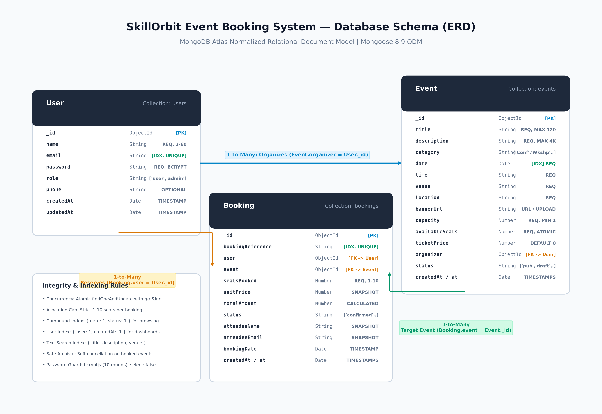
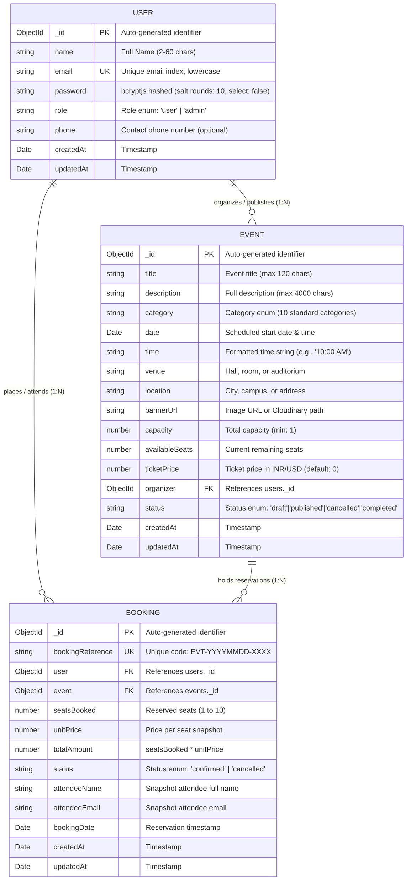

# SkillOrbit Database Schema Specification

**SkillOrbit Web Development Capstone Project: Event Booking System**  
**Database Engine:** MongoDB Atlas (Mongoose ODM 8.9+)  
**Architecture:** Normalized Document-Relational Hybrid Model  

---

## 1. Overview & Data Architecture

The SkillOrbit Event Booking System utilizes **MongoDB Atlas** with **Mongoose 8.9+** Object Data Modeling (ODM) on Node.js. The schema design applies a decoupled document-relational model specifically engineered for concurrency safety, data integrity, and fast read queries.

### Key Architectural Principles:
1. **Normalized Relational Integrity:** Strong document references (`ref: 'User'`, `ref: 'Event'`) link bookings to users and events, ensuring a single source of truth for dynamic entities.
2. **Selective Denormalization / Historical Snapshots:** When a ticket reservation is created, critical fields (`unitPrice`, `attendeeName`, `attendeeEmail`) are snapshot directly into the `bookings` collection. If an event price changes in the future or a user updates their profile, existing financial and ticket records remain legally and historically immutable.
3. **Atomic Concurrency Protection:** High-velocity seat allocations use atomic MongoDB operations (`findOneAndUpdate` with `$gte` and `$inc`) to guarantee zero overselling without distributed database locks.
4. **Targeted Compound Indexing:** Indexes on `{ date: 1, status: 1 }`, `{ user: 1, createdAt: -1 }`, and full-text search indexes guarantee fast query execution times (<15ms) across catalogs and dashboards.

---

## 2. Entity Relationship Diagram (ERD)

The diagram below illustrates the collections, attributes, keys, and 1-to-many relationships in the SkillOrbit system:



### Mermaid Representation


---

## 3. Detailed Data Models

### 3.1 `users` Collection (`backend/models/User.js`)

Stores user credentials, role identities, and profile details for regular attendees and administrative organizers.

| Field Name | Type | Constraints / Validation | Default | Description |
| :--- | :--- | :--- | :--- | :--- |
| `_id` | `ObjectId` | Primary Key, Auto-generated | Auto | Unique identifier for user |
| `name` | `String` | Required, Trimmed, Min: 2, Max: 60 | None | Attendee or administrator full name |
| `email` | `String` | Required, Unique, Lowercase, Trimmed, Regex Email | None | User login identifier and notification address |
| `password` | `String` | Required, Min: 6 chars, `select: false` | None | Bcrypt hashed password (10 salt rounds) |
| `role` | `String` | Enum: `['user', 'admin']` | `'user'` | Role-based access control level |
| `phone` | `String` | Optional, Trimmed | `''` | Contact telephone number |
| `createdAt` | `Date` | Managed by Mongoose timestamps | Auto | Account registration timestamp |
| `updatedAt` | `Date` | Managed by Mongoose timestamps | Auto | Last profile update timestamp |

#### Security & Lifecycle Hooks
- **Bcrypt Hashing Pre-Save Hook:** Automatically hashes plain passwords with `bcryptjs` using a salt work factor of 10 whenever `isModified('password')` is true.
- **Hidden Password Projection:** Configured with `select: false` so user queries omit password hashes by default, preventing accidental leak in API responses.
- **Instance Method `comparePassword(candidate)`:** Securely validates plain text credentials against the stored bcrypt hash using constant-time comparison.

---

### 3.2 `events` Collection (`backend/models/Event.js`)

Maintains event catalog entries, venue information, capacity limits, real-time seat inventory, and publication status.

| Field Name | Type | Constraints / Validation | Default | Description |
| :--- | :--- | :--- | :--- | :--- |
| `_id` | `ObjectId` | Primary Key, Auto-generated | Auto | Unique identifier for event |
| `title` | `String` | Required, Trimmed, Max: 120 chars | None | Title of the event or conference |
| `description` | `String` | Required, Max: 4000 chars | None | Detailed event agenda and overview |
| `category` | `String` | Enum: 10 allowed categories | `'Technology'` | Classification category |
| `date` | `Date` | Required | None | Scheduled calendar date of the event |
| `time` | `String` | Required, Trimmed | None | Human-readable schedule (e.g. `'09:30 AM'`) |
| `venue` | `String` | Required, Trimmed | None | Facility name, hall number, or room |
| `location` | `String` | Required, Trimmed | None | Geographic location, campus, or city |
| `bannerUrl` | `String` | Optional, Valid URL | `''` | URL or path to event promotional banner |
| `capacity` | `Number` | Required, Min: 1 | None | Total physical seating capacity |
| `availableSeats`| `Number` | Required, Min: 0 | Capacity | Real-time remaining unbooked seats |
| `ticketPrice` | `Number` | Min: 0 | `0` | Cost per ticket in currency units (0 = Free) |
| `organizer` | `ObjectId` | Required, `ref: 'User'` | None | Foreign key referencing the creating admin |
| `status` | `String` | Enum: `['draft', 'published', 'cancelled', 'completed']` | `'published'` | Publication lifecycle state |
| `createdAt` | `Date` | Managed by Mongoose timestamps | Auto | Event creation timestamp |
| `updatedAt` | `Date` | Managed by Mongoose timestamps | Auto | Last event update timestamp |

#### Allowed Category Values
`'Technology'`, `'Workshops'`, `'Conferences'`, `'Design'`, `'Business'`, `'Cultural'`, `'Sports'`, `'Academic'`, `'Hackathon'`, `'Other'`.

---

### 3.3 `bookings` Collection (`backend/models/Booking.js`)

Maintains immutable records of user ticket purchases, snapshot prices, attendee details, and reservation status.

| Field Name | Type | Constraints / Validation | Default | Description |
| :--- | :--- | :--- | :--- | :--- |
| `_id` | `ObjectId` | Primary Key, Auto-generated | Auto | Unique identifier for booking |
| `bookingReference`| `String` | Required, Unique, Format: `EVT-YYYYMMDD-XXXX` | Auto | Human-readable verification code |
| `user` | `ObjectId` | Required, `ref: 'User'` | None | Foreign key of reserving account |
| `event` | `ObjectId` | Required, `ref: 'Event'` | None | Foreign key of reserved event |
| `seatsBooked` | `Number` | Required, Min: 1, Max: 10 | `1` | Count of tickets booked in transaction |
| `unitPrice` | `Number` | Required, Min: 0 | `0` | Snapshot ticket price at reservation time |
| `totalAmount` | `Number` | Required, Min: 0 | `0` | Calculated cost (`seatsBooked * unitPrice`) |
| `status` | `String` | Enum: `['confirmed', 'cancelled']` | `'confirmed'` | Current booking state |
| `attendeeName` | `String` | Required, Trimmed | None | Snapshot primary attendee name |
| `attendeeEmail` | `String` | Required, Lowercase, Trimmed | None | Snapshot delivery email address |
| `bookingDate` | `Date` | Required | `Date.now` | Timestamp of booking creation |
| `createdAt` | `Date` | Managed by Mongoose timestamps | Auto | Record creation timestamp |
| `updatedAt` | `Date` | Managed by Mongoose timestamps | Auto | Record update timestamp |

---

## 4. Database Indexing Strategy

To support high-throughput event discovery and responsive sub-second dashboard rendering, the schema defines the following performance indexes:

### 4.1 `users` Indexes
```javascript
userSchema.index({ email: 1 }, { unique: true });
```
- **Purpose:** Enforces unique email registration at the database level and accelerates authentication lookups (`findOne({ email })`) to O(1) time complexity.

### 4.2 `events` Indexes
```javascript
eventSchema.index({ date: 1, status: 1 });
eventSchema.index({ category: 1 });
eventSchema.index({ organizer: 1 });
eventSchema.index({ title: 'text', description: 'text', venue: 'text' });
```
- **`{ date: 1, status: 1 }` (Compound Index):** Optimizes the primary homepage query filtering for upcoming published events (`status: 'published', date: { $gte: now }`).
- **`{ category: 1 }` (Single Index):** Speeds up catalog category filtering tabs.
- **`{ organizer: 1 }` (Single Index):** Accelerates organizer-specific event lookups in administrative portals.
- **`{ title: 'text', description: 'text', venue: 'text' }` (Text Index):** Powers high-performance full-text search across keywords without external search engine dependencies.

### 4.3 `bookings` Indexes
```javascript
bookingSchema.index({ bookingReference: 1 }, { unique: true });
bookingSchema.index({ user: 1, createdAt: -1 });
bookingSchema.index({ event: 1 });
```
- **`{ bookingReference: 1 }` (Unique Index):** Guarantees global uniqueness for digital ticket verification lookups.
- **`{ user: 1, createdAt: -1 }` (Compound Index):** Optimizes attendee dashboards sorting user reservations by most recent first.
- **`{ event: 1 }` (Single Index):** Accelerates event attendee roster lookups and administrative aggregation queries.

---

## 5. Concurrency Control & Atomic Operations

### 5.1 Concurrency-Safe Reservation Engine
During high-traffic ticket releases, multiple users may attempt to reserve the final seats simultaneously. To eliminate race conditions and avoid overselling, SkillOrbit executes an atomic reservation query directly on MongoDB:

```javascript
// Step 1: Pre-booking validation
// Verify cumulative limit: user cannot exceed 10 total active seats for this event
const userBookings = await Booking.find({
  user: userId,
  event: eventId,
  status: 'confirmed'
});
const currentBookedSeats = userBookings.reduce((sum, b) => sum + b.seatsBooked, 0);

if (currentBookedSeats + seatsBooked > 10) {
  return res.status(400).json({
    success: false,
    message: `Exceeds max limit. You already have ${currentBookedSeats} seats booked.`
  });
}

// Step 2: Atomic conditional update
const event = await Event.findOneAndUpdate(
  {
    _id: eventId,
    status: 'published',
    availableSeats: { $gte: seatsBooked }
  },
  {
    $inc: { availableSeats: -seatsBooked }
  },
  { new: true }
);

if (!event) {
  return res.status(409).json({
    success: false,
    message: 'Event is sold out or insufficient seats available.'
  });
}

// Step 3: Insert booking record
try {
  const booking = await Booking.create({
    bookingReference: generateBookingReference(),
    user: userId,
    event: eventId,
    seatsBooked,
    unitPrice: event.ticketPrice,
    totalAmount: seatsBooked * event.ticketPrice,
    status: 'confirmed',
    attendeeName: user.name,
    attendeeEmail: user.email,
    bookingDate: new Date()
  });
} catch (bookingError) {
  // Compensation rollback if booking document insertion fails
  await Event.findByIdAndUpdate(eventId, {
    $inc: { availableSeats: seatsBooked }
  });
  throw bookingError;
}
```

### 5.2 Atomic Cancellation & Rollback
When an attendee cancels an active booking, the system executes a safe atomic reversal:
```javascript
const booking = await Booking.findOneAndUpdate(
  { _id: bookingId, user: userId, status: 'confirmed' },
  { status: 'cancelled' },
  { new: true }
);

if (!booking) {
  return res.status(400).json({ success: false, message: 'Active booking not found.' });
}

// Re-increment availableSeats atomically back to event inventory
await Event.findByIdAndUpdate(booking.event, {
  $inc: { availableSeats: booking.seatsBooked }
});
```

---

## 6. Data Integrity & Constraints Summary

| Rule Category | Mechanism | Enforcement Level |
| :--- | :--- | :--- |
| **Email Uniqueness** | Unique B-Tree Index + lowercase schema setter | Database & Mongoose Layer |
| **Password Protection** | Pre-save bcryptjs hashing (10 rounds) + `select: false` | Mongoose Model Layer |
| **Seat Inventory Floor** | Atomic `$gte: seatsBooked` guard + schema `min: 0` | Atomic Query & Schema |
| **Per-User Limit** | Cumulative check (max 10 seats per user per event) | Controller Business Logic |
| **Booking Reference** | Unique alphanumeric format `EVT-YYYYMMDD-XXXX` | Helper + Unique Index |
| **Event Deletion Guard**| Soft cancellation (`status: 'cancelled'`) if bookings exist | Event Controller Guard |
| **Financial Immutability**| Snapshots of `unitPrice`, `attendeeName`, `attendeeEmail` | Booking Schema Layer |
