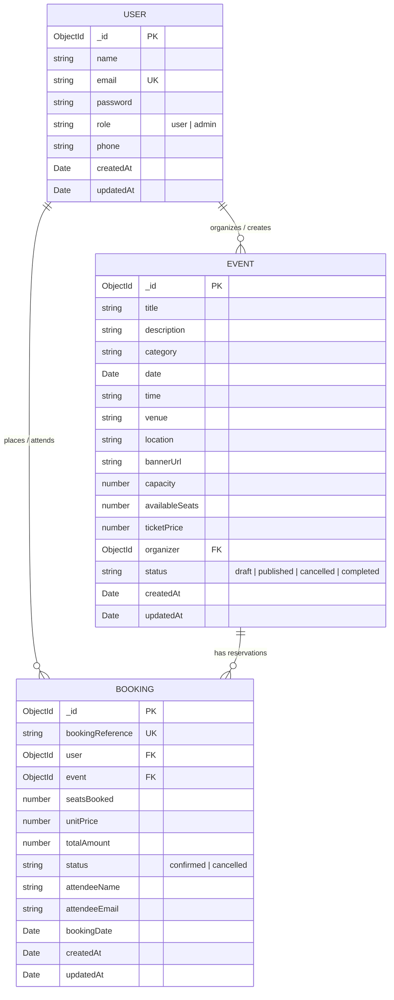

# Database Schema Specification
**SkillOrbit Web Development Capstone Project — Event Booking System**

---

## 1. Overview
The database for the SkillOrbit Event Booking System is built on **MongoDB Atlas** (cloud-hosted MongoDB cluster) utilizing **Mongoose ODM 8.9+** on Node.js. The design follows an optimized document-relational hybrid model:
- **Normalized relational references** (`ref: 'User'`, `ref: 'Event'`) ensure single source of truth for dynamic entities.
- **Selective denormalization** (`unitPrice`, `attendeeName`, `attendeeEmail` on Bookings) ensures historical snapshot consistency even if user or event details change later.
- **Atomic MongoDB operators** (`$inc`, `$gte`, `$nin`) guarantee zero overselling and concurrency-safe seat reservation without requiring heavy distributed transaction locks.

---

## 2. Entity Relationship Diagram (ERD)



---

## 3. Collection Specifications

### 3.1 Users Collection (`users`)
Stores both attendee profiles and administrative organizers.

| Field | Type | Required | Constraints / Defaults | Description |
| :--- | :--- | :---: | :--- | :--- |
| `_id` | ObjectId | Yes | Primary Key, Auto-generated | Unique document identifier |
| `name` | String | Yes | Trim, Min: 2, Max: 60 chars | Attendee or Admin's full name |
| `email` | String | Yes | Trim, Lowercase, Unique, Valid RFC Email | Account login credential & notification target |
| `password` | String | Yes | Min: 6 chars, `select: false` | Salted bcrypt hash (10 salt rounds) |
| `role` | String | Yes | Enum: `['user', 'admin']`, Default: `'user'` | Role-based authorization switch |
| `phone` | String | No | Trim, Default: `""` | Contact phone number |
| `createdAt` | Date | Auto | ISO 8601 Timestamp | Record creation date |
| `updatedAt` | Date | Auto | ISO 8601 Timestamp | Record last update date |

**Indexes:**
- `{ email: 1 }` (Unique, B-tree index for O(1) login lookup)

**Sample Document:**
```json
{
  "_id": "674cc0010000000000000001",
  "name": "Alex Johnson",
  "email": "alex.johnson@skillorbit.edu",
  "role": "user",
  "phone": "+91 9876543210",
  "createdAt": "2026-10-01T04:15:22.100Z",
  "updatedAt": "2026-10-01T04:15:22.100Z"
}
```

---

### 3.2 Events Collection (`events`)
Stores events organized on the platform.

| Field | Type | Required | Constraints / Defaults | Description |
| :--- | :--- | :---: | :--- | :--- |
| `_id` | ObjectId | Yes | Primary Key, Auto-generated | Unique event identifier |
| `title` | String | Yes | Trim, Max: 120 chars | Name of the event / workshop |
| `description` | String | Yes | Trim, Max: 4000 chars | Full agenda, details, guidelines |
| `category` | String | Yes | Enum: `['Conference', 'Workshop', 'Concert', 'College Fest', 'Webinar', 'Networking', 'Tech Talk', 'Cultural', 'Sports', 'Other']`, Default: `'Workshop'` | Category categorization |
| `date` | Date | Yes | Valid Date object | Date of event occurrence |
| `time` | String | Yes | Trim, Freeform string (e.g., "10:00 AM - 04:00 PM") | Event time window |
| `venue` | String | Yes | Trim | Specific auditorium, lab, or virtual link |
| `location` | String | Yes | Trim | Campus block, city, or "Online / Remote" |
| `bannerUrl` | String | No | Default: High-res Unsplash event image | URL to event promotional poster |
| `capacity` | Number | Yes | Min: 1 | Initial total capacity |
| `availableSeats` | Number | Yes | Min: 0 | Dynamically decremented remaining seats |
| `ticketPrice` | Number | No | Min: 0, Default: 0 | Ticket price in INR |
| `organizer` | ObjectId | Yes | Reference: `User` model | Admin who posted the event |
| `status` | String | Yes | Enum: `['draft', 'published', 'cancelled', 'completed']`, Default: `'published'` | Event lifecycle state |
| `createdAt` | Date | Auto | ISO 8601 Timestamp | Event record creation date |
| `updatedAt` | Date | Auto | ISO 8601 Timestamp | Event record last update date |

**Indexes:**
- `{ date: 1, status: 1 }` (Compound index for filtering upcoming published events)
- `{ category: 1 }` (Single field index for fast category filtering)
- `{ title: 'text', description: 'text', venue: 'text' }` (Compound text search index)

**Sample Document:**
```json
{
  "_id": "674cc0020000000000000002",
  "title": "Full-Stack Cloud Architecture Summit",
  "description": "Comprehensive one-day summit exploring modern cloud microservices, reactive architectures, and automated CI/CD deployment pipelines.",
  "category": "Conference",
  "date": "2026-11-15T09:00:00.000Z",
  "time": "09:30 AM - 05:00 PM",
  "venue": "APJ Abdul Kalam Auditorium, Academic Block 3",
  "location": "Main Campus, Hyderabad",
  "bannerUrl": "https://images.unsplash.com/photo-1540575467063-178a50c2df87?w=1200&auto=format&fit=crop&q=80",
  "capacity": 250,
  "availableSeats": 242,
  "ticketPrice": 199,
  "organizer": "674cc0000000000000000000",
  "status": "published",
  "createdAt": "2026-10-01T04:20:00.000Z",
  "updatedAt": "2026-10-01T05:12:10.000Z"
}
```

---

### 3.3 Bookings Collection (`bookings`)
Records confirmed reservations placed by attendees.

| Field | Type | Required | Constraints / Defaults | Description |
| :--- | :--- | :---: | :--- | :--- |
| `_id` | ObjectId | Yes | Primary Key, Auto-generated | Unique MongoDB booking ID |
| `bookingReference` | String | Yes | Uppercase, Trim, Unique | Human-readable pass code (`EVT-YYYYMMDD-XXXX`) |
| `user` | ObjectId | Yes | Reference: `User` model | Account of the booking attendee |
| `event` | ObjectId | Yes | Reference: `Event` model | Target event registered |
| `seatsBooked` | Number | Yes | Min: 1, Max: 10 per transaction | Number of seats reserved |
| `unitPrice` | Number | No | Min: 0, Default: 0 | Price snapshot per ticket at booking time |
| `totalAmount` | Number | No | Min: 0, Default: 0 | `seatsBooked * unitPrice` |
| `status` | String | Yes | Enum: `['confirmed', 'cancelled']`, Default: `'confirmed'` | Booking reservation status |
| `attendeeName` | String | No | Trim | Name printed on the boarding pass |
| `attendeeEmail` | String | No | Trim, Lowercase | Email recipient for booking confirmation |
| `bookingDate` | Date | Auto | Default: `Date.now` | Time when booking was submitted |
| `createdAt` | Date | Auto | ISO 8601 Timestamp | Database record creation date |
| `updatedAt` | Date | Auto | ISO 8601 Timestamp | Database record update date |

**Indexes:**
- `{ bookingReference: 1 }` (Unique B-tree index for O(1) pass lookups)
- `{ user: 1, createdAt: -1 }` (Compound index for rapid user booking history retrieval)
- `{ event: 1 }` (Foreign reference index for attendee count aggregation)

**Sample Document:**
```json
{
  "_id": "674cc0030000000000000003",
  "bookingReference": "EVT-20261001-A9F21B",
  "user": "674cc0010000000000000001",
  "event": "674cc0020000000000000002",
  "seatsBooked": 2,
  "unitPrice": 199,
  "totalAmount": 398,
  "status": "confirmed",
  "attendeeName": "Alex Johnson",
  "attendeeEmail": "alex.johnson@skillorbit.edu",
  "bookingDate": "2026-10-01T05:12:10.000Z",
  "createdAt": "2026-10-01T05:12:10.000Z",
  "updatedAt": "2026-10-01T05:12:10.000Z"
}
```

---

## 4. Concurrency & Data Integrity Strategy

### 4.1 Race Condition Prevention (Atomic Decrement)
In high-demand event scenarios (e.g., last 2 seats remaining with multiple simultaneous requests), traditional read-then-write logic creates severe overselling bugs. The SkillOrbit platform solves this using MongoDB's atomic document-level locking via `findOneAndUpdate`:

```javascript
const event = await Event.findOneAndUpdate(
  {
    _id: eventId,
    status: 'published',
    availableSeats: { $gte: seats }, // Atomic guard condition
  },
  {
    $inc: { availableSeats: -seats }, // Atomic decrement operator
  },
  {
    new: true,
  }
);

if (!event) {
  // Either event not found, unpublished, or seats sold out right before write
  return res.status(400).json({
    success: false,
    message: 'Insufficient seats available.',
  });
}
```

### 4.2 Safe Capacity Modification
When administrators update event capacity, the system calculates existing commitments:
```javascript
const bookedSeats = event.capacity - event.availableSeats;
if (newCapacity < bookedSeats) {
  return res.status(400).json({
    success: false,
    message: `Cannot reduce capacity below currently booked seats (${bookedSeats})`,
  });
}
event.capacity = newCapacity;
event.availableSeats = newCapacity - bookedSeats;
```

### 4.3 Atomic Rollback on Cancellation
When an attendee or admin cancels a booking, the reserved seats are safely returned to the pool using `$inc`:
```javascript
booking.status = 'cancelled';
await booking.save();

await Event.findByIdAndUpdate(booking.event, {
  $inc: { availableSeats: booking.seatsBooked },
});
```

### 4.4 Audit Trail Preservation
When an event with active bookings is deleted by an admin, the system automatically transitions the event to `'cancelled'` instead of executing a destructive hard delete, preserving financial and attendance audit trails:
```javascript
const confirmedBookings = await Booking.countDocuments({
  event: event._id,
  status: 'confirmed',
});

if (confirmedBookings > 0) {
  event.status = 'cancelled';
  await event.save();
  return res.status(200).json({
    success: true,
    message: `Event has ${confirmedBookings} active booking(s). Status set to cancelled to protect historical data.`,
    event,
  });
}
```
